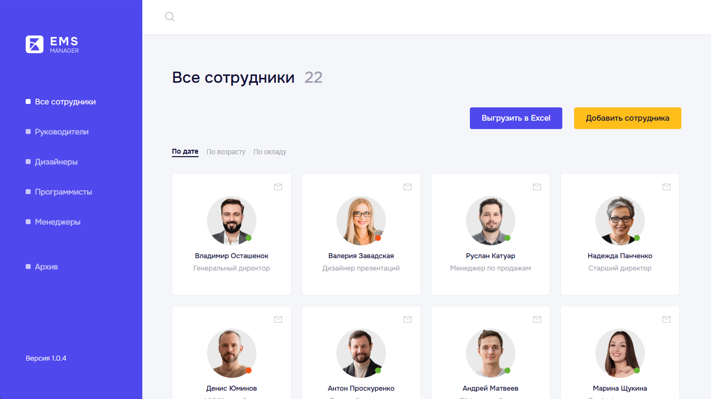
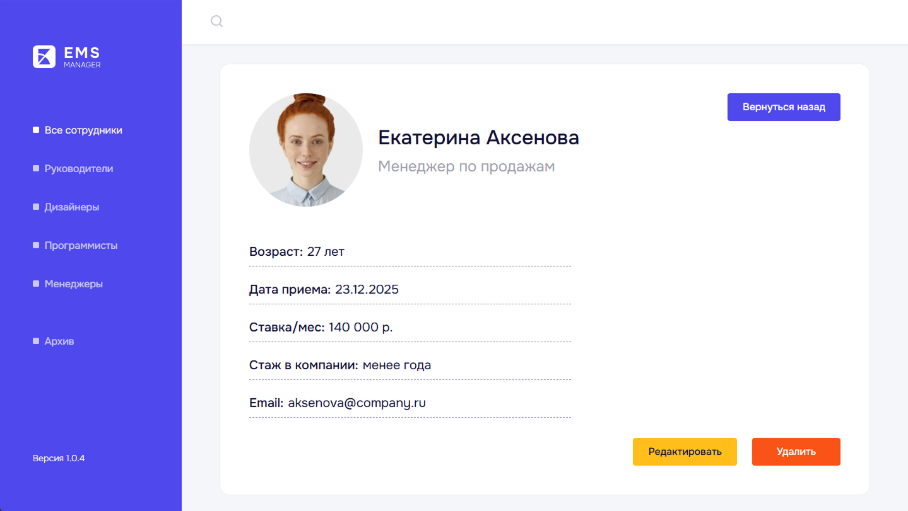

# Employees Management System

**Employees Management System** — это веб-приложение для управления сотрудниками компании.  
Система предоставляет единое хранилище данных сотрудников с возможностью фильтрации, редактирования, архивации и экспорта данных.

Проект ориентирован на использование в небольших и средних командах для структурированного управления персоналом.

---

## 🔗 Демо

🔹 Live demo: _ссылка будет добавлена_  
<br>


---

## 🖼️ Интерфейс



*Список сотрудников*



*Детальная информация*

---

## 🧩 Основные возможности

### Управление сотрудниками

- Добавление новых сотрудников
- Редактирование данных сотрудника
- Удаление сотрудников с переносом в архив
- Просмотр детальной информации по клику на карточку

### Категории и отделы

- Все сотрудники
- Руководители
- Дизайнеры
- Программисты
- Менеджеры
- Архив

При изменении отдела сотрудник автоматически перемещается в соответствующую категорию.

### Архив

- Восстановление сотрудников из архива
- Безвозвратное удаление отдельных сотрудников
- Очистка архива одной кнопкой

### Фильтрация и сортировка

- По дате добавления
- По возрасту
- По окладу

### Экспорт данных

- Выгрузка сотрудников выбранной категории в Excel-файл

---

## 📋 Данные по умолчанию

При первом запуске приложение автоматически заполняется демо-сотрудниками
с вымышленными именами, должностями и распределением по отделам.

---

## 🛠️ Технологии

### Frontend

- Vue 3
- Composition API
- Vue Router
- Pinia
- Vite
- TypeScript

### Стили

- SCSS
- PostCSS

### Библиотеки

- Axios
- uuid
- vue3-json-excel
- vue3-spinners

---

## 🚀 Установка и запуск

```bash
# Установка зависимостей
npm install

# Запуск проекта в режиме разработки
npm run dev

# Сборка проекта
npm run build
```

---

## 👤 Автор

**Андрей Самойленко**

📧 Email: hotalert@vk.com<br>
💬 Telegram: @hotalert

---

## 📄 Лицензия
Все права защищены.

Использование, копирование, модификация и распространение данного проекта
запрещены без предварительного письменного согласия автора.
